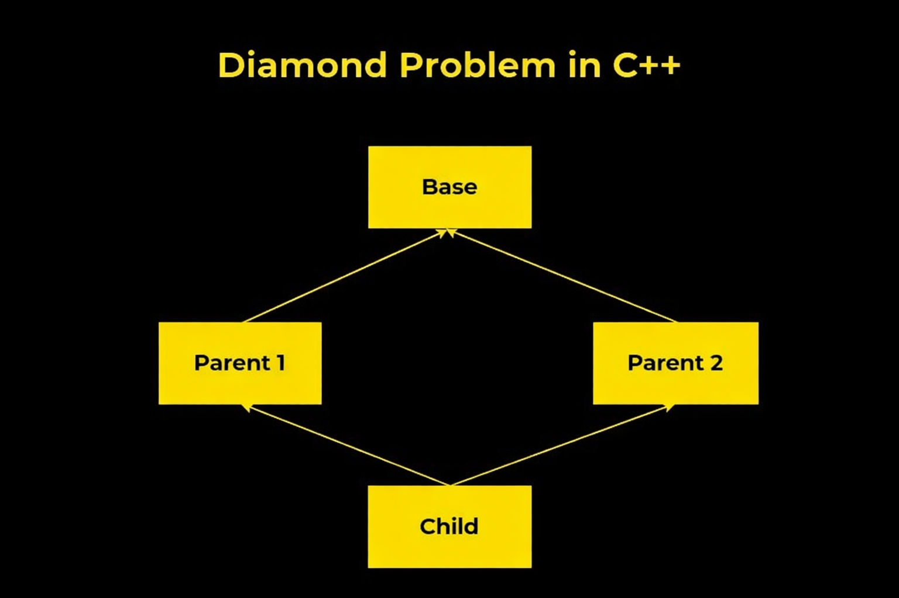

# 22. What is the diamond problem?

## 💡Definition

The **Diamond problem** is a common issue in C++ that arises with multiple inheritance when a class inherits from two or more classes that themselves inherit from a common base class, creating a diamond-shaped structure.

This creates ambiguity because the derived class ends up with multiple copies of the base class, leading to confusion about which copy to use.



---

## 💡Detailed example

```cpp
class Base {
private:
    int data;
public:
    void setData(int value) { data = value; }
    int getData() { return data; }
};

class Derived1 : public Base {};

class Derived2 : public Base {};

class FinalDerived : public Derived1, public Derived2 {
public:
    void showData() {
        // std::cout << getData() << std::endl; // ERROR: Ambiguity here
    }
};

int main() {
    FinalDerived obj;
    // obj.setData(5); // ERROR: Ambiguity here
    obj.showData(); // Ambiguity: Which data to print?
}
```

### Explanation of the Problem:

* ```Base``` is the common base class. ```Derived1``` and ```Derived2``` both inherit from ```Base```. ```FinalDerived``` inherits from both ```Derived1``` and ```Derived2```.

* This results in ```FinalDerived``` having two copies of the ```Base``` class: one from ```Derived1``` and one from ```Derived2```.

* When accessing ```setData()``` or ```getData()``` in ```FinalDerived```, the compiler doesn't know which copy to use, leading to ambiguity.

### Solution 1: Explicit Disambiguation

This approach involves using the **scope resolution operator** (```::```) to specify which base class's member you want to access. However, this solution **does not eliminate the duplication of the base class**; it only resolves the ambiguity in accessing the members.

```cpp
class Base {
private:
    int data;
public:
    void setData(int value) { data = value; }
    int getData() { return data; }
};

class Derived1 : public Base {};

class Derived2 : public Base {};

class FinalDerived : public Derived1, public Derived2 {
public:
    void showData() {
        // std::cout << getData() << std::endl; // ERROR: Ambiguity here
        std::cout << Derived1::getData() << std::endl;
        std::cout << Derived2::getData() << std::endl;
    }
};

int main() {
    FinalDerived obj;
    // obj.setData(5); // ERROR: Ambiguity here
    obj.Derived1::setData(10); // Set data through Derived1
    obj.Derived2::setData(20); // Set data through Derived2

    obj.showData();
}
```

#### Limitations of This Approach

* **Code duplication:** The base class is duplicated in the final derived class object, which can lead to wasted memory and potential inconsistencies.

* **Manual resolution:** Every access to the ambiguous members must be explicitly resolved using the scope resolution operator, which can make the code verbose and harder to maintain.

* **No shared state:** If the base class is meant to have a shared state across all derived classes, this approach will not work because the state is duplicated.

### Comparison with Virtual Inheritance

While it is possible to resolve the diamond problem without virtual inheritance by explicitly disambiguating member access, this approach is generally less efficient and harder to maintain.

**Virtual inheritance** is the preferred solution because it ensures a single shared instance of the base class, eliminates ambiguity, and simplifies the code.

<table border="1" cellpadding="6" cellspacing="0">
  <tr>
    <th>Aspect</th>
    <th>Without Virtual Inheritance</th>
    <th>With Virtual Inheritance</th>
  </tr>
  <tr>
    <td>Common Base Class Copies</td>
    <td>Multiple copies (one per inheritance path)</td>
    <td>Single shared copy</td>
  </tr>
  <tr>
    <td>Memory Usage</td>
    <td>Higher (due to duplication)</td>
    <td>Lower (no duplication)</td>
  </tr>
  <tr>
    <td>State Sharing</td>
    <td>No shared state</td>
    <td>Shared state</td>
  </tr>
  <tr>
    <td>Ambiguity Resolution</td>
    <td>Manual (using <code>::</code>)</td>
    <td>Automatic (no ambiguity)</td>
  </tr>
  <tr>
    <td>Code Complexity</td>
    <td>More verbose and harder to maintain</td>
    <td>Cleaner and easier to maintain</td>
  </tr>
</table>

### Solution 2: Virtual Inheritance - prefered solution

* To resolve the diamond problem, C++ provides **virtual inheritance**.

* By using the ```virtual``` keyword when inheriting from the common base class, you ensure that only one instance of the base class is shared among the derived classes.

```cpp
class Base {
private:
    int data;
public:
    void setData(int value) { data = value; }
    int getData() { return data; }
};

class Derived1 : public virtual Base {};

class Derived2 : public virtual Base {};

class FinalDerived : public Derived1, public Derived2 {
public:
    void showData() {
        std::cout << getData() << std::endl;
    }
};

int main() {
    FinalDerived obj;
    obj.setData(5);
    obj.showData();
}
```

---

## 🧪 Code example
- [`../../code/level-2/22-diamond-problem`](../../code/level-2/22-diamond-problem)
